# Computing e to 10¹¹ Digits on MI300A: the Hard Parts, Explained

*A technical exposition of `ecalc`. Every chapter is written in four layers: an intuition a
non-specialist can follow, the precise mathematics, the conditions under which it is correct
(and how it failed in this codebase), and what it buys, measured.*

---

## Contents

0. [The map](#0-the-map)
A. [The whole calculation, step by step](#a-the-whole-calculation-step-by-step)
1. [Binary splitting: why the cost is M(N)·log N, and why the tree runs level by level](#1-binary-splitting-the-cost-and-the-execution-order)
2. [Convolution in exact arithmetic: the number-theoretic transform](#2-convolution-in-exact-arithmetic-the-number-theoretic-transform)
3. [Several primes at once: the residue number system and reconstruction](#3-several-primes-at-once-rns-and-crt)
4. [Exact modular multiplication with floating-point hardware](#4-exact-modular-multiplication-with-floating-point-hardware)
5. [The transform kernel: why fewer instructions made it slower](#5-the-transform-kernel)
6. [Transforms larger than one GPU: the distributed four-step algorithm](#6-the-distributed-four-step-transform)
7. [Products larger than a plane: grid splitting](#7-grid-splitting)
8. [Division by Newton's method, done exactly](#8-division-by-newtons-method-done-exactly)
9. [Base 10¹⁸ throughout: deleting the radix conversion](#9-base-10-throughout)
10. [Carries across four GPUs: carry propagation as a parallel prefix](#10-carries-as-a-parallel-prefix)
11. [Memory as the binding constraint](#11-memory-as-the-binding-constraint)
12. [Proving the digits correct, and two bugs the proof caught](#12-proving-the-digits-correct)
13. [Scaling to 576 nodes (modelled)](#13-scaling-to-576-nodes)
14. [Evaluation and lessons](#14-evaluation-and-lessons)
- [References](#references)
- [Appendix: parameters](#appendix-parameters)

---

## 0. The map

$$
e \;=\; \sum_{k\ge 0}\frac{1}{k!} \;=\; 1 + \frac{P}{Q}
$$

`ecalc` computes $d$ decimal digits of $e$ in five phases on one node of four AMD MI300A
APUs (each a CPU and GPU sharing ≈ 128 GB of HBM), or over many such nodes:

| phase | computes | chapter |
|---|---|---|
| **bs** — binary splitting | integers $P, Q$ with $P/Q = \sum_{k=1}^{N} 1/k!$ | 1 |
| **10dP** | $A = 10^{d}\,(P+Q)$ | 9 |
| **dm** — division | $X = \lfloor A/Q \rfloor$, by a Newton reciprocal | 8 |
| **dc** — radix conversion | decimal digits of $X$ (deleted in the final design) | 9 |
| **T1/T2** — verification | residue identities and digit windows | 12 |

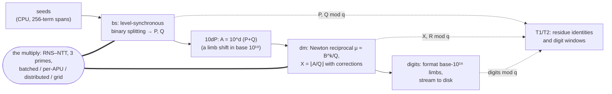
*Figure 0. The pipeline. Solid arrows: data; dotted: what verification reads; the double line marks the phases built on the multiply.*

Every expensive step reduces to one primitive — the product of two integers of up to
several billion 64-bit words — and that primitive (chapters 2–7) is where most of the engineering
lives. One observation governs every design decision: **on this machine memory, not time, limits
the digit count.** The arithmetic for 10¹¹ digits takes minutes; the storage takes the whole node.
An optimisation that buys speed with memory is therefore moving in the wrong direction, and the
record (§14) shows that nearly every rejected idea was of that kind.

Headline results, all measured and verified unless marked:

| run | result |
|---|---|
| 4 × 10¹⁰ digits, one node | **63.5 ± 1.5 s** wall (the reproduced paper: 285.7 s) |
| 10¹¹ digits, one node | 263 s, 445 GB |
| 1.4 × 10¹¹ digits, one node | 485 s, 466.6 GB |
| 4.25 × 10¹³ digits, 576 nodes | ≈ 3.9 min, 452 GB/node — **modelled** |

---

## A. The whole calculation, step by step

This chapter follows one computation from its input, the number of digits $d$, to its output, the digit
string. It shows how the problem is broken into parts and transformed at each stage, and why the result is
exactly right. Every number in it comes from `docs/walk/toy_run.py`, which runs **the same algorithm with
`ecalc`'s own parameters** on a small input, $d = 200$:

- base-$10^{18}$ limbs;
- the three primes $c\cdot 2^{44}+1$ and their roots from `modarith.h`;
- the Newton step of `newton.c` and the division of `newton_divmod`.

It then gives the same stages at the size of a real run, $d = 4\times10^{10}$. The later chapters explain the
machinery of each stage in depth. This one is the map of how the stages fit together.

### A.1 The chain of transformations

The calculation is a chain of five exact transformations. Only the first one approximates anything:

$$
\underbrace{e = \sum_{k\ge 0}\frac1{k!}}_{\text{the definition}}
\ \xrightarrow{\ \text{truncate at }N\ }\
\underbrace{1 + \frac{P}{Q}}_{\text{binary splitting}}
\ \xrightarrow{\ \times 10^{d}\ }\
\underbrace{\frac{A}{Q},\ A = 10^{d}(P+Q)}_{\text{one integer quotient}}
\ \xrightarrow{\ \text{Newton}\ }\
\underbrace{X = \Big\lfloor\frac{A}{Q}\Big\rfloor}_{\text{exact integer}}
\ \xrightarrow{\ \text{format}\ }\
\text{“2.71828…”}
$$

**Why the answer is right.** Let $e_N = 1 + P/Q$ be the truncated sum. By the tail bound of §1.2 and the choice
of $N$ (below), $0 < e - e_N < 1/(N!\,N) < 10^{-(d+50)}$. Multiply by $10^d$:

$$
0 \;<\; 10^d e - \frac{A}{Q} \;<\; 10^{-50}.
$$

The integer $X = \lfloor A/Q\rfloor$ therefore equals $\lfloor 10^d e\rfloor$, the first $d+1$ digits of $e$, unless an
integer lies strictly between $A/Q$ and $10^d e$. That requires the fractional part of $10^d e$ to be below
$10^{-50}$, meaning 50 consecutive zeros in $e$'s expansion right after position $d$. Everything after truncation
is exact integer arithmetic, and the division is exact by construction (§A.7). So **the only approximation in the
whole computation is the truncation, and its error is 50 digits below the last digit reported.**

### A.2 Stage 0: from $d$ to the parameters

**The term count.** $N$ is the smallest integer with $\log_{10}N! \ge d + 50$. Since
$\log_{10}N! = \ln\Gamma(N+1)/\ln 10$ is increasing, `ecalc` finds $N$ by bisection on the C library's
`lgamma`: about 60 evaluations (doubling to bracket $N$, then halving), where a linear scan needed $4.3\times10^9$.

**The representation.** Every integer is an array of **limbs**, the digits of the number in base $B = 10^{18}$
(the largest power of ten below $2^{64}$), stored least significant first:

$$
x = \sum_{i=0}^{n-1} x_i\,B^{i},\qquad 0 \le x_i < B .
$$

| quantity | toy run, $d = 200$ | real run, $d = 4\times10^{10}$ |
|---|---|---|
| terms $N$ | 145 ($\log_{10}145! = 251.9$) | 4 346 031 742 |
| $Q = N!$ | 252 digits = 14 limbs | $2.222\times10^9$ limbs (40 GB) |
| $A = 10^d(P+Q)$ | 26 limbs | $4.444\times10^9$ limbs |
| reciprocal precision $k = n_A - n_Q + 1$ | 13 limbs | ≈ $2.22\times10^9$ limbs |
| output $X$ | 201 digits | $4\times10^{10}+1$ digits |

### A.3 Stage 1: the seeds

The range of terms $[0, N)$ is cut into **seed spans** of consecutive terms: 16 in the toy run, 256 in
`ecalc`. Inside a span, $P$ and $Q$ are built one term at a time with word-sized arithmetic. Adding term $k$ to
the span $[a, k-1)$ multiplies $Q$ by $k$, and the new term $a!/k!$ becomes exactly $1$ once scaled by the new
$Q(a,k) = k!/a!$:

$$
Q(a,k) = Q(a,k-1)\cdot k,\qquad P(a,k) = P(a,k-1)\cdot k + 1 .
$$

For example, the first span of 8 terms gives $P(0,8)/Q(0,8) = 69281/40320 = \sum_{k=1}^{8}1/k!$. The seeds are
independent, so `ecalc` computes them on the CPU while the GPUs are still being initialised (RESULTS §69).

### A.4 Stage 2: the merge levels

The seeds are the leaves of a binary tree. Each level merges adjacent pairs with the recurrence of §1.2:

$$
P = P_1Q_2 + P_2,\qquad Q = Q_1Q_2 .
$$

A merge is therefore **two big products and one addition**. Both products share the operand $Q_2$. When a level
has an odd number of nodes, the last one is copied up unchanged. (That copy was the site of the race found in
§12.4.) The toy run's tree, with the limb count of each node's $Q$:

| level | nodes | limbs of $Q$ per node |
|---|---|---|
| 0 (seeds) | 10 | 1 2 2 2 2 2 2 2 2 1 |
| 1 | 5 | 2 3 4 4 3 |
| 2 | 3 | 5 8 3 |
| 3 | 2 | 12 3 |
| 4 (root) | 1 | 14 |

The sizes roughly double at each level, as §1.3 predicts. They are uneven because later terms are larger:
the span $[64,128)$ has 8 limbs against 5 for $[0,64)$. At the root, the script checks $Q = 145!$ exactly.

At full size ($d = 4\times10^{10}$) there are 25 levels above the 256-term seeds. The top of the tree is where
the work is:

| level from the top | nodes | $Q$ of the largest node | product sizes, limbs |
|---|---|---|---|
| 3 | 8 | $2.9\times10^8$ | ≈ $2.9\times10^8 \times 2.9\times10^8$ |
| 2 | 4 | $5.8\times10^8$ | ≈ $5.8\times10^8 \times 5.8\times10^8$ |
| 1 | 2 | $1.15\times10^9$ | ≈ $1.1\times10^9 \times 1.1\times10^9$ |
| 0 (root) | 1 | $2.22\times10^9$ | — (the result) |

The last merge produces a product of $2.2\times10^9$ limbs, more than the $2^{31}\approx 2.15\times10^9$-point plane
cap. It is therefore computed as a grid of piece products (chapter 7), while the lower levels go through the
batched and per-APU tiers (§1.4).

### A.5 Inside one product

Every product in stages 2, 4 and 5 goes through the same eight steps. Here is the toy run's level-2 merge
$P(0,64)\cdot Q(64,128)$, a 5-limb number times an 8-limb one.

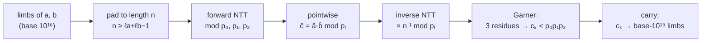
*Figure A1. One product. Every arrow is exact integer arithmetic. The three primes run independently until
Garner's step joins them.*

1. **Choose the length.** The product has $5 + 8 - 1 = 12$ coefficients, and the smallest admissible length is
   $n = 12 = 3\cdot 2^2$, a mixed-radix length (§2.3). A power-of-two design would pad to 16.
2. **Choose the roots.** For each prime, $\omega_{12} = \omega_{3\cdot2^{33}}^{\,2^{31}}$, a power of the
   `ec_W3X33` constant. It has exact order 12.
3. **Forward transforms.** $\hat a = F_{12}\,a$ and $\hat b = F_{12}\,b$ modulo each $p_i$: 12 residues per operand per
   prime.
4. **Pointwise product.** $\hat c_k = \hat a_k \hat b_k \bmod p_i$. This single line *is* the convolution.
5. **Inverse transforms.** $c = n^{-1}F_{12}^{-1}\hat c \bmod p_i$. Each prime now holds every coefficient
   $c_k = \sum_{i+j=k}a_ib_j$ reduced modulo $p_i$.
6. **Reconstruct.** Coefficient $c_1 = a_0b_1 + a_1b_0$ arrives as three residues:

   $$
   c_1 \bmod (p_0, p_1, p_2) = (3358104948782169,\ 3500052316097566,\ 1264840967479048).
   $$

   Garner's formulas (§3.3) turn them into

   $$
   c_1 = 138724505180013176\,679894676812120115 \;<\; p_0p_1p_2 \approx 5.8\times10^{46},
   $$

   the exact value, as the bound $n(B-1)^2 = 1.2\times10^{37} < p_0p_1p_2$ guarantees.
7. **Carry.** Each coefficient is up to 3 limbs wide, so it is split in base $10^{18}$ and added into the limbs
   at positions $k$, $k+1$ and $k+2$. Here
   $c_0 = 54844316730212301\cdot B + 0$ and $c_1 = 138724505180013176\cdot B + 679894676812120115$. So limb 0
   is 0, limb 1 is $679894676812120115 + 54844316730212301 = 734738993542332416$ (no overflow), and
   $138724505180013176$ carries into limb 2, and so on.
8. **Check.** The script asserts that the resulting limbs equal the product computed by Python's own big
   integers.

At full scale the same eight steps run with $n$ up to $3\cdot 2^{30}$ or $2^{31}$ points per prime, spread across
the four APUs (chapter 6) or cut into grid pieces (chapter 7). But the mathematics is exactly this.

### A.6 Stage 3: the scaled numerator

The quotient $A/Q$ must have $d$ digits after the point, so the numerator is scaled by $10^d$. In base
$10^{18}$ that is almost free. With $d = 18\,t + s$ ($0 \le s < 18$),

$$
A = 10^{d}(P + Q) = \big(10^{s}(P+Q)\big)\cdot B^{t},
$$

one multiplication by a single word and a shift by $t$ whole limbs. For the toy run, $200 = 18\cdot 11 + 2$:
multiply $P+Q$ by 100 and shift by 11 limbs, giving $n_A = 26$ limbs. In `ecalc`'s device flow the shift is
never even materialised: the division reads $A$ as $S\cdot B^{t}$ with $S = P+Q$ (`newton_db_divmod_shifted`).

### A.7 Stage 4: the reciprocal

Division is replaced by multiplication by a precomputed reciprocal. With $n_Q$ limbs in $Q$ and
$k = n_A - n_Q + 1$ (the number of quotient limbs), `ecalc` computes

$$
\mu \;\approx\; \Big\lfloor \frac{B^{\,n_Q + k}}{Q} \Big\rfloor ,
$$

an integer of $k+1$ limbs: the first $k$ limbs of $1/Q$, scaled to be an integer.

**Seed.** From the top 4 limbs $q_t$ of $Q$, rounded up, one schoolbook division gives
$r = \lfloor B^{6}/(q_t + 1)\rfloor \approx B^{n_Q+2}/Q$, correct to $j = 2$ limbs.

**Schedule.** The precisions are planned backwards from $k$ by halving and rounding up (§8.3):
$13 \to 7 \to 4 \to 2$, so the steps are $2 \to 4 \to 7 \to 13$.

**Each step** (§8.2) forms the scaled residual $d = B^{2j} - \lfloor Q_t r / B^{\text{take}-j}\rfloor$ and the correction
$\lfloor r\,|d|/B^{j}\rfloor$. The toy run's steps:

| step | limbs of $Q$ used (`take`) | relative residual $d/B^{2j}$ | error of $r'$ (units in the last limb) |
|---|---|---|---|
| $2 \to 4$ | 6 | $6.6\times10^{-37}$ | 0 |
| $4 \to 7$ | 10 | $3.2\times10^{-73}$ | 0 |
| $7 \to 13$ | 14 | $3.7\times10^{-128}$ | 0 |

The residual's exponent roughly doubles each step ($-37, -73, -128$): Newton's quadratic convergence,
measured in digits. Each step also reads only the top $2j+2$ limbs of $Q$. The final $\mu$ equals
$\lfloor B^{27}/Q\rfloor$ exactly. The error bound of §8.4 allows a few units, and the division absorbs them.

At full scale the same schedule is 31 steps, $2 \to 3 \to 5 \to 9 \to 17 \to \cdots \to 1.11\times10^9 \to 2.22\times10^9$ limbs, and,
since the precision doubles each step, the last step alone costs about as much as all the earlier ones combined.

### A.8 Stage 5: the quotient and the remainder

With $\mu$ in hand:

1. **Estimate.** Keep only the top $k$ limbs of $A$, $A_h = \lfloor A/B^{\,n_Q-1}\rfloor$ (the dropped limbs change the
   quotient by less than one unit), and form

   $$
   X_0 = \Big\lfloor \frac{A_h\,\mu}{B^{\,k+1}} \Big\rfloor \;\approx\; \frac{A}{B^{\,n_Q-1}}\cdot\frac{B^{\,n_Q+k}}{Q}\cdot\frac{1}{B^{\,k+1}} = \frac{A}{Q}.
   $$

2. **Remainder.** $R = A - X_0Q$. Since $R$ is known to be within a few multiples of $Q$ of zero, only its low
   $n_Q + 2$ limbs are computed, using a *low product* (§7.2). Its sign is read from the top limb of that window.
3. **Correct.** While $R < 0$, set $X \leftarrow X - 1$. While $R \ge Q$, set $X \leftarrow X + 1$. Stop with
   $0 \le R < Q$, which is exactly the definition of $X = \lfloor A/Q\rfloor$. More than 64 corrections aborts the run.

In the toy run, $X_0$ needed **no** corrections, and $R/Q = 0.157$. The result is

$$
X = 2718281828459045235360287471352662497757247093699959574966967627724076630353547594571382178525166427\ldots5101901,
$$

all 201 digits of $\lfloor 10^{200}e\rfloor$.

### A.9 Stage 6: digits and verification

**Digits.** $X$ is already decimal. Its top limb holds the leading "2", and every other limb prints as exactly 18
digits with leading zeros kept. Inserting the decimal point after the first digit gives the output. At full scale
each node formats its own limbs and streams them to disk in chunks (RESULTS §76).

**Verification.** With $q = 2^{62} + 135$ (the first T1 modulus), the toy run computes both sides of
$T(P+Q) \equiv XQ + R \pmod q$ independently:

$$
10^{200}(P+Q) \bmod q = 1911749413146909884 = (XQ + R) \bmod q .
$$

$P \bmod q$ and $Q \bmod q$ come from running the seed recurrence of §A.3 directly in $\mathbb{Z}/q$, never from the
big integers. So the identity checks every product, the reciprocal and the division at once (chapter 12).

### A.10 Where each stage's cost goes

| stage | mathematics | dominant operation | 4 × 10¹⁰ digits, Phase 13c (s) |
|---|---|---|---|
| seeds | $P, Q$ over 256-term spans | word × limb | overlapped with init |
| merge levels | $P_1Q_2+P_2$, $Q_1Q_2$ | batched, per-APU and grid products | bs 23.7 |
| scaling | $A = 10^d(P+Q)$ | limb shift | ≈ 0 |
| reciprocal + division | $\mu$, then $X$, $R$ | 31 Newton steps + 2 full products | dm 22.5 |
| digits + verification | formatting, residues | streaming I/O, Horner | < 0.1 (overlapped) |

(Stage times from RESULTS §80: phases 46.3 s of the 63.5 s wall; the rest is initialisation.)

---

## 1. Binary splitting: the cost and the execution order

### 1.1 Intuition

Adding $1/k!$ one term at a time to a running total of $d$ digits costs $d$ digits of work per
term, and there are billions of terms: quadratic, hopeless. Binary splitting instead adds the terms
as *exact fractions* in a balanced tree. Leaves are tiny; each internal node combines two
fractions into one with a few multiplications. The numbers only become large near the root, and
there are few nodes there. The work is therefore concentrated in a handful of huge
multiplications, which is exactly what fast multiplication is good at.

### 1.2 The recurrence

For $0 \le a < b$ define

$$
Q(a,b) = \prod_{k=a+1}^{b} k, \qquad
\frac{P(a,b)}{Q(a,b)} = \sum_{k=a+1}^{b}\ \prod_{i=a+1}^{k}\frac{1}{i}.
$$

Then for any split point $a < m < b$, since every term of the right half carries the extra factor
$1/Q(a,m)$,

$$
\frac{P(a,b)}{Q(a,b)} = \frac{P(a,m)}{Q(a,m)} + \frac{1}{Q(a,m)}\cdot\frac{P(m,b)}{Q(m,b)}
\quad\Longrightarrow\quad

$$
P(a,b) = P(a,m)\,Q(m,b) + P(m,b), \qquad Q(a,b) = Q(a,m)\,Q(m,b),
$$

with leaves $P(a,a{+}1) = 1,\ Q(a,a{+}1) = a+1$, and $e = 1 + P(0,N)/Q(0,N)$ with an error below
$1/N!$. This is the classical binary-splitting scheme for hypergeometric-type series (Haible & Papanikolaou 1998;
Brent & Zimmermann 2010, §4.9; Arndt 2011). The truncation error is exactly the tail,

$$
0 < e - 1 - \frac{P(0,N)}{Q(0,N)} = \sum_{k>N}\frac{1}{k!} = \frac{1}{(N+1)!}\Big(1 + \frac{1}{N+2} + \cdots\Big) < \frac{1}{N!\,N}.
$$

*Worked example ($N = 4$, split at $m = 2$).* Left: $P(0,2)/Q(0,2) = 1 + \tfrac12 = \tfrac32$. Right:
$P(2,4)/Q(2,4) = \tfrac13 + \tfrac1{12} = \tfrac5{12}$. Merge: $P = 3\cdot 12 + 5 = 41$, $Q = 2\cdot 12 = 24$, and
indeed $1 + \tfrac12 + \tfrac16 + \tfrac1{24} = \tfrac{41}{24}$. No division, no rounding, and only one
large-by-large product per sequence. Because every term's ratio to its predecessor is
$1/k$ with no numerator polynomial, $e$ needs only **two** sequences, where π's Chudnovsky series needs
three ($P, Q, T$). That is one reason $e$ is the natural target for a memory-bound machine.

The term count is the smallest $N$ with $\log_{10} N! \ge d + 50$, which by the tail bound leaves 50 guard digits. `ecalc` finds it by bisection on
`lgamma`. (A linear scan of 4.3 × 10⁹ `lgamma` calls had silently cost 45 s outside every phase
timer; RESULTS §40.)

### 1.3 Why the cost is $O(M(S)\log N)$

Let $S = \log_2 Q(0,N) \approx N\log_2 N$ be the size of the result. At tree depth $\ell$ the node
sizes **add up to $S$**, because $\log Q(a,b)$ is additive over disjoint ranges. A level therefore
costs $\sum_i M(s_i)$ with $\sum_i s_i = S$. If $M(s)/s$ is non-decreasing (true for every multiplication algorithm of interest, and for
$M(s) = c\,s\log s$), then

$$
\sum_i M(s_i) = \sum_i s_i\,\frac{M(s_i)}{s_i} \le \sum_i s_i\,\frac{M(S)}{S} = M(S).
$$

(Stirling gives $S = \log_2 N! = N\log_2 N - N\log_2 e + O(\log N)$.) There are $\lceil\log_2 N\rceil$ levels, so

$$
T_{\text{bs}} = O\big(M(S)\,\log N\big).
$$

At $d = 10^{11}$ digits, $N \approx 1.0 \times 10^{10}$ terms and the depth is 33–34.

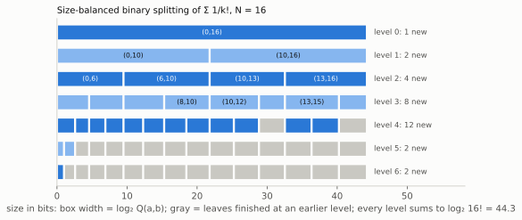

*Figure 1. The binary-splitting tree for $N = 16$, drawn to scale. Each box is a node $(a,b)$ with width
$\log_2 Q(a,b)$ bits. Every level spans the same total width $\log_2 16!$, which is the
additivity behind $T_{\text{bs}} = O(M(S)\log N)$. The balanced split puts $m$ at 10, not 8, because
late terms are larger.*

**Size-balanced splitting.** Since $\log Q(a,b) = \log b! - \log a!$ grows with $k$, splitting at
the index midpoint gives unbalanced children (Yee: 215 vs 311 digits for $100!$). Choosing $m$ so
that both children have equal $\log Q$ — a binary search on Stirling's formula — minimises
$\sum M(s_i)$, because for a superlinear $M$ the sum is smallest when the parts are equal. It also
makes the split of memory between two subtrees exact.

### 1.4 Execution order: depth-first vs level-synchronous

A textbook implementation recurses depth-first and issues one multiplication at a time. At
10¹¹ digits the tree has ≈ 10¹⁰ leaves. Even with a 1024-term base case that is 2 × 10⁷
multiplications of ~10 GPU kernels each at ≈ 4 µs per launch: **815 s of pure launch overhead**,
more than the whole computation (ALGORITHM R1).

`ecalc` runs the tree **level by level, bottom-up**. Level $j$ has $2^j$ *independent* merges of
*equal* size, so each stage of the product (split, transform, pointwise, inverse, CRT) runs as
**one batched launch** over all $2^j$ merges. That is ~33 levels × ~10 kernels, a few hundred
launches in total.

**Claim: this costs no extra memory.** A depth-first stack holds one pending result per level,
of sizes $W/2, W/4, \dots$ — a geometric sum of ≈ $W$ per sequence, $2W$ for $P$ and $Q$. A level
sweep holds the $2^j$ results of one level, of size $W/2^j$ each: again $W$ per sequence. Same peak,
$10^3\times$ fewer launches. A useful side effect: at level $j$ the batch is $2^j$ transforms of
length $L/2^j$, the same total number of points at every level, which gives the kernels a uniform shape.

**The tiers.** The bottom of the tree is not NTT territory. `ecalc` computes **seeds** (spans of 256
terms) on the CPU during initialisation. It then runs the batched GPU tier up the lower
levels, and finally, for the few huge top-level products, the distributed tiers of chapters 6–7.

---

## 2. Convolution in exact arithmetic: the number-theoretic transform

### 2.1 Intuition

Write an integer in base $B$ as a polynomial: $a = \sum a_i B^i$. Multiplying integers is then
multiplying polynomials, i.e. **convolving** their coefficient lists,
$c_k = \sum_{i+j=k} a_i b_j$, followed by carrying. Convolution costs $n^2$ directly, but a Fourier
transform turns it into a pointwise product:

$$
c = \mathcal{F}^{-1}\big(\mathcal{F}(a)\cdot\mathcal{F}(b)\big),
$$

and the FFT computes $\mathcal{F}$ in $O(n\log n)$ (Cooley & Tukey 1965). Precisely, a length-$n$ DFT turns
*cyclic* convolution (products taken mod $x^n - 1$) into a pointwise product, so $n$ must be at least
$\ell_a + \ell_b - 1$ for the cyclic wrap-around to add only zeros. With complex floating-point numbers the result
carries rounding errors that grow with $n$. At billions of points they would swamp the answer
unless each coefficient carried very few bits. The **number-theoretic transform (NTT)** performs
the same algebra in the integers modulo a prime $p$, where arithmetic is **exact** (Pollard 1971; Crandall & Pomerance 2005, §9.5).

### 2.2 What the DFT needs, and where to find it in ℤ/p

The DFT of length $n$ needs a **primitive $n$-th root of unity** $\omega$: $\omega^n = 1$ and
$\omega^k \ne 1$ for $0<k<n$. Its correctness rests on the orthogonality relation

$$
\sum_{j=0}^{n-1}\omega^{jk} = \begin{cases} n & k \equiv 0 \pmod n\\ 0 & \text{otherwise},\end{cases}
$$

which holds whenever $\omega$ is primitive and $n$ is invertible. The multiplicative group
$(\mathbb{Z}/p)^\times$ is cyclic of order $p-1$, so a primitive $n$-th root exists **iff
$n \mid p-1$**: take $\omega = g^{(p-1)/n}$ for a generator $g$. The prime therefore dictates the
admissible transform lengths. `ecalc` uses

$$
p_i = c_i\cdot 2^{44} + 1,\qquad c_i \in \{240,\,216,\,207,\,147\},\qquad p_i < 2^{52},
$$

every $c_i$ divisible by 3. Every length $n = 2^k$ or $3\cdot 2^k$ with $k \le 33$ (the code's
chosen maximum) therefore has a root. The constants `ec_W33` (order $2^{33}$) and `ec_W3X33` (order
$3\cdot 2^{33}$) in `modarith.h` are those roots, and every other root is a power of them.

*Worked example.* $p = 17$, $n = 4$, $\omega = 4$ ($4^2 = 16 \equiv -1$, $4^4 \equiv 1$), $\omega^{-1} = 13$,
$n^{-1} = 13$. To multiply $12 \times 13$ in base 10, take $a = (2,1,0,0)$ and $b = (3,1,0,0)$, least significant first:

| $k$ | $\hat a_k = \sum_j a_j\omega^{jk}$ | $\hat b_k$ | $\hat c_k = \hat a_k\hat b_k$ | $c_k = n^{-1}\sum_j \hat c_j\,\omega^{-jk}$ |
|---|---|---|---|---|
| 0 | 3 | 4 | 12 | 6 |
| 1 | 6 | 7 | 8 | 5 |
| 2 | 1 | 2 | 2 | 1 |
| 3 | 15 | 16 | 2 | 0 |

(all mod 17). The result is $c = (6,5,1,0)$, i.e. $6 + 50 + 100 = 156$. Every step is exact because each
true coefficient is below $p$. Chapter 3 is about guaranteeing that at scale.

### 2.3 Why the lengths $3\cdot 2^k$ matter

The transform length must be at least the product's length. With only powers of two, a product one
limb past $2^k$ must be padded to $2^{k+1}$ points, doubling time and memory. Allowing $3\cdot 2^k$
places a length between every pair of powers of two, which caps the padding waste at 50 %
instead of 100 % (Figure 2). A radix-3 layer (`ntt3.c`) factors $n = 3\cdot 2^k$ as a length-3 transform composed
with length-$2^k$ transforms via the same Cooley–Tukey index split as §6. A length-3 DFT with
$\omega_3 = \omega_n^{n/3}$ looks like it needs four multiplications, but since $1 + \omega_3 + \omega_3^2 = 0$,

$$
X_0 = x_0 + x_1 + x_2,\qquad
X_1 = (x_0 - x_2) + \omega_3\,(x_1 - x_2),\qquad
X_2 = (x_0 - x_1) - \omega_3\,(x_1 - x_2),
$$

so a radix-3 butterfly needs **one** modular multiplication plus additions. The truncated Fourier
transform (van der Hoeven 2004) exists to smooth out exactly this power-of-two jump; here, the mixed
radix together with the plane cap of chapter 7 makes it unnecessary.

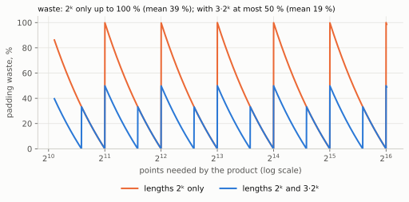

*Figure 2. Padding waste $L/n - 1$ when the length $L$ is the smallest admissible one $\ge n$. Powers of two
alone waste up to 100 % (39 % on average over $n$); adding $3\cdot 2^k$ caps the waste at 50 % (19 % on average).*

Measured: decimal phase −7 s at 4 × 10¹⁰, no memory change (RESULTS §57).

### 2.4 The forward/inverse pairing

The forward transform is **decimation-in-frequency** (Gentleman–Sande butterflies,
$(u,v) \mapsto (u+v,\ (u-v)\,\omega)$). One stage is the identity (using $\omega_n^{n/2} = -1$)

$$
X[2k] = \sum_{j<n/2}\big(x_j + x_{j+n/2}\big)\,\omega_{n/2}^{jk},\qquad
X[2k+1] = \sum_{j<n/2}\big(x_j - x_{j+n/2}\big)\,\omega_n^{j}\;\omega_{n/2}^{jk},
$$

that is, two half-length DFTs of the butterfly outputs, one giving the even and one the odd frequencies.
Recursing $\log_2 n$ times leaves the output in bit-reversed order. The inverse is
**decimation-in-time** (Cooley–Tukey, $(u,v)\mapsto(u+\omega v,\ u-\omega v)$), which *accepts*
bit-reversed input. The pointwise product does not care about order, so **no bit-reversal
permutation is ever performed**. That saves a full pass over memory per transform. The $1/n$ scaling
and the pointwise product are fused into the neighbouring passes for the same reason.

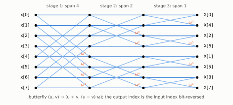

*Figure 3. Decimation-in-frequency (Gentleman & Sande 1966) for $n = 8$. Each stage halves the butterfly span,
and the output appears in bit-reversed order: $X[4]$ sits in position 1 because $1 = 001_2$ reverses to $100_2 = 4$.
The DIT inverse is this graph mirrored: it consumes bit-reversed input and produces natural order.*

---

## 3. Several primes at once: RNS and CRT

### 3.1 Intuition

The NTT computes each coefficient $c_k$ only **modulo $p$**. If the true $c_k$ exceeds $p$, the answer
is wrong. One 52-bit prime is far too small: a coefficient is a sum of up to $n$ products of two
limbs. The trick is to run the same convolution modulo several primes and reconstruct $c_k$ from its
remainders. Knowing a number mod 5 and mod 7 determines it mod 35 (the Chinese remainder theorem),
and in general it determines it modulo the product of the primes. If that product exceeds the
largest possible coefficient, the reconstruction is exact.

### 3.2 The bound, and why base $10^{18}$ needs only three primes

With limbs in $[0,B)$ and a convolution over $n$ terms,

$$
0 \le c_k \le n\,(B-1)^2 .
$$

Exactness requires $n\,(B-1)^2 < \prod_i p_i$.

| limb base | $(B-1)^2$ | primes | $\prod p_i$ | max terms $n$ |
|---|---|---|---|---|
| $10^{18}$ | $2^{119.59}$ | 3 ($c = 240, 216, 207$) | $2^{155.36}$ | $2^{35.76}$ (27× margin at $2^{31}$) |
| $2^{64}$ | $2^{128}$ | 3 | $2^{155.36}$ | $2^{27}$ — too few |
| $2^{64}$ | $2^{128}$ | 4 | $2^{206.5}$ | ample |

So the decimal pipeline runs three transforms per operand where binary needs four (`ECALC_NP`,
`ec_np_check` refuses unsafe combinations). The choice of limb base, made for a different reason in
chapter 9, also cuts the transform work by a quarter.

### 3.3 Reconstruction: Garner's algorithm

Given residues $r_i = c \bmod p_i$, Garner (1959) builds $c$ in mixed radix without ever forming a
number larger than the result:

$$
c = v_0 + v_1\,p_0 + v_2\,p_0p_1 + \cdots,\qquad
v_0 = r_0,\quad v_1 = (r_1 - v_0)\,p_0^{-1} \bmod p_1,\quad \ldots
$$

and in full, for three primes,

$$
v_2 = \big((r_2 - v_0)\,p_0^{-1} - v_1\big)\,p_1^{-1} \bmod p_2 ,
\qquad 0 \le v_i < p_i ,
$$

with the inverses $p_0^{-1} \bmod p_1$ and so on precomputed (Knuth, TAOCP vol. 2, §4.3.2).
Because $0 \le v_i < p_i$, the result satisfies $0 \le c < p_0p_1p_2$: this is the unique representative, which is the
exact coefficient whenever the bound of §3.2 holds. *Small example* ($p = 5, 7, 11$; $c = 156$; residues $r = (1, 2, 2)$):
$v_0 = 1$; $v_1 = (2-1)\cdot 5^{-1} \bmod 7 = 1\cdot 3 = 3$; $v_2 = \big((2-1)\cdot 5^{-1} - 3\big)\cdot 7^{-1} \bmod 11 = (9-3)\cdot 8 \bmod 11 = 4$;
so $c = 1 + 3\cdot 5 + 4\cdot 35 = 156$. Every step is a modular operation on one
word, so each coefficient reconstructs independently: an embarrassingly parallel GPU kernel. The
result is a 3-word (decimal) or 4-word (binary) integer per coefficient, which is then split into
base-$B$ digits (`ec_words_to_dec3`: three Barrett divisions by $10^{18}$) and **carried**. Because a
coefficient is below $p_0p_1p_2 < 2^{156} < B^3$, it spans at most 3 limbs, and the carry into limb $k$ depends only on coefficients $k-1, k-2$
(the "3-limb window"), so the carry is also local, except for rare long runs (chapter 10).

**Engineering.** The CRT kernel is striped by coefficient and reads all prime planes coalesced. It
writes results straight into registered host memory or device pools, with the limb additions of the
binary-splitting recurrence ($P_1Q_2 + P_2$) and the normalisation folded in, so there is no separate
addition pass. It runs at 0.5 s per $2^{31}$ points against 0.8–1.5 s for a 192-thread CPU Garner, and
lifted the batch tier from 1.2 to 4.3 Gpoint/s (RESULTS §39, §43).

---

## 4. Exact modular multiplication with floating-point hardware

This is the inner loop of everything: each transform performs $\tfrac n2\log_2 n$ butterflies, each
containing one modular multiplication $a\cdot\omega \bmod p$.

### 4.1 Intuition

A modular multiply needs the full product $ab$ (up to 104 bits for 52-bit operands) and then the
remainder mod $p$. Dividing is slow, so all fast methods replace the division by a multiplication by a
precomputed approximation of $1/p$, then correct a small error. GPUs have fast 64-bit floating-point
units, but a double holds only 53 significant bits, so a product of two 52-bit numbers does not fit.
The technique here recovers the part the rounding throws away, exactly, with one extra instruction.

### 4.2 The error-free product (Dekker / TwoProduct)

For doubles $a, b$ let $h = \mathrm{fl}(ab)$, the rounded product. With a fused multiply-add
(which rounds only once),

$$
\ell = \mathrm{fma}(a, b, -h) \quad\Longrightarrow\quad ab = h + \ell \ \text{exactly}.
$$

This is the error-free transformation of Dekker (1971), in the FMA form called *2MultFMA* (Ogita, Rump & Oishi
2005; Muller et al. 2018, ch. 4). The identity holds for any product that neither overflows nor underflows. It holds because the rounding error of a product is itself representable. The pair $(h,\ell)$
is a 106-bit product in two registers.

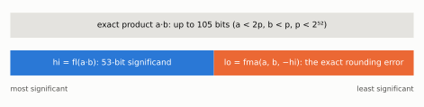

*Figure 4. The exact product $ab$ of a lazy $a < 2p$ and canonical $b < p$ is split into the rounded
$h$ and the exact error $\ell$, with $|\ell| \le \tfrac12\,\mathrm{ulp}(h) \le 2^{51}$.*

### 4.3 Barrett reduction on that pair

Barrett (1986) reduction estimates $q = \lfloor ab/p\rfloor$ by multiplying with a precomputed
reciprocal, then subtracts. `ec_mm` (in `modarith.h`) is eight lines:

```c
double hi = a * b;                  // rounded product
double lo = fma(a, b, -hi);         // exact low part:  a*b = hi + lo
double q  = floor(hi * pinv);       // pinv = 1/p: quotient estimate, off by a small integer
double r  = fma(-q, p, hi) + lo;    // a*b - q*p, computed with one rounding
r += (r < 0.0 ? p : 0.0);  r += (r < 0.0 ? p : 0.0);    // two corrections up
r -= (r >= p ? p : 0.0);   r -= (r >= p ? p : 0.0);     // two corrections down
```

Why it works, as an error budget. All four primes satisfy $2^{51} < p < 2^{52}$. With $a < 2p$ and $b < p$,
$h/p < 2p < 2^{53}$. The two roundings in `hi * pinv` (in $1/p$ and in the product) each contribute a relative
error of at most $2^{-53}$, so $\mathrm{fl}(h\cdot p^{-1})$ is within about $2^{53}\cdot 2^{-52} = 2$ of $h/p$. And
$|\ell|/p < 1$, so $h/p$ is within 1 of $ab/p$. Hence $q$ differs from $\lfloor ab/p\rfloor$ by a small integer,
and $ab - qp$ lies a small multiple of $p$ away from the true remainder. It is an integer of modest size, so the single-rounding
`fma` computes $hi - qp$ exactly, adding $lo$ restores the dropped bits, and at most two
additions or subtractions of $p$ land in $[0,p)$.

### 4.4 The condition, and how it was learned

"Small" is conditional. The argument needs the intermediate $ab - qp$ to fit the 53-bit significand,
which bounds the operand ranges. The rule, established by randomized and adversarial testing
(`bench/15`, `tests/t_modarith`; RESULTS §19, §30):

> **At most one operand may be "lazy" (in $[0,2p)$); the other must be canonical (in $[0,p)$).**
> With both lazy, or either in $[0,4p)$, the result is wrong in 0.4–21 % of cases.

The rule is the error budget above made concrete. With both operands lazy, $h/p$ reaches $4p \approx 2^{54}$, the
quotient estimate's error doubles, and the intermediate $h - qp$ is no longer guaranteed to fit the 53-bit
significand, so the `fma` itself rounds. The repository establishes the admissible ranges empirically rather
than with a formal proof.

A second rule: **butterfly additions are done in 64-bit integers, never in doubles.** $u+v$ with
$u, v < 2p \approx 2^{52.8}$ exceeds $2^{53}$ and does not survive a round trip through FP64. The
butterfly is therefore a hybrid: FP64 for the multiply, integer ALU for the adds and subtractions.

### 4.5 Alternatives, and why this one wins

| method | idea | cost in this setting |
|---|---|---|
| Montgomery (1985) | replace division by $p$ with division by $2^{64}$, work in "Montgomery form" | needs both 64-bit halves of a 128-bit product: 25.5 cyc/modmul |
| **Shoup / Harvey** (Harvey 2014) | for a *fixed* multiplier $w$, precompute $w' = \lfloor w\,2^{64}/p\rfloor$; $q = \mathrm{hi}_{64}(a\,w')$, $r = aw - qp \bmod 2^{64} \in [0,2p)$ | the best integer method: 15.2 cyc/modmul; enables lazy $[0,4p)$ butterflies |
| **FP64 Barrett** (chosen) | §4.3 | 22 VALU instructions, 1 330 Gmodmul/s/APU |

Shoup's method is worth stating precisely, because it is the standard of comparison (Harvey 2014): for
$p < 2^{63}$, a fixed $w < p$ and $w' = \lfloor w\,2^{64}/p\rfloor$, every $a < 2^{64}$ gives

$$
q = \Big\lfloor \frac{a\,w'}{2^{64}} \Big\rfloor \ \Longrightarrow\ 0 \le a w - q p < 2p ,
$$

(proof: write $w' = w2^{64}/p - \delta$ and $q = aw'/2^{64} - \delta'$ with $\delta,\delta'\in[0,1)$; then
$aw - qp = a\delta p/2^{64} + \delta' p < 2p$), so $aw - qp$ can be computed with wrapping 64-bit arithmetic (the true value is known to be small), and the
result is left in $[0, 2p)$ without a correction. Harvey's butterflies keep all values lazily in $[0, 4p)$ and
reduce only when a bound would be exceeded.

In a register-only micro-benchmark, Shoup beat FP64 Barrett by 1.14×. **In a real transform pass it
was 2–3 % slower**, and integer Montgomery chains ran 25 % below FP64 Barrett (RESULTS §47–48). The
reason is instruction-level parallelism across execution units: the FP64 multiply and the integer
adds of the butterfly **co-issue** on different pipes, while an all-integer butterfly queues
everything on one. An earlier design built on two 62-bit Shoup primes (denser: 45 bits per point) was
built as "engine 2", verified exact, and ran **2.2× slower end to end with a higher peak** (RESULTS
§44). Its density advantage only exists in a design where transform planes, not limbs, dominate
memory, which this design is not.

---

## 5. The transform kernel

### 5.1 Intuition

A GPU transform is limited by *data movement*: each butterfly stage touches every point, and main
memory (HBM) is far slower than on-chip storage. The fix is to load a block of points once, perform
as many stages as possible on-chip, and write back once. The on-chip hierarchy has two levels:
**registers** (private to a thread, fastest) and **LDS** (local data share: ~64 KiB per compute
unit, shared by a thread block, organised in 32 banks).

### 5.2 Register blocking

A length-$2^s$ transform needs $s$ stages. The key fact is that **each stage acts on exactly one bit of the
point index**: DIF stage $t$ pairs index $m$ with $m \oplus 2^{s-t}$. In the simple kernel every stage reads its pair
from LDS, computes, writes back, and synchronises: $s$ round trips and $s$ barriers. In the **register-blocked**
kernel each thread holds 8 (or 16) points in registers. Three (or four) consecutive stages pair only
points *within* one thread's set, so they run with no communication at all. Between groups of stages
the block exchanges data through LDS once, as a transpose. `ecalc`'s production body does **7 stages
with 8 rows per thread and two LDS exchanges**: +19 % forward and +15 % inverse over the reproduced
paper's tile kernel at $2^{31}$ points, bit-identical output (RESULTS §43).

In index terms: a thread that holds the 8 points whose indices differ only in bits $\{b_6, b_5, b_4\}$ can
perform the three stages acting on those bits alone. An LDS exchange then redistributes the points so that
each thread holds a set differing in the next three bits. Figure 10 shows one grouping of 7 stages consistent
with 8 points per thread and two exchanges.

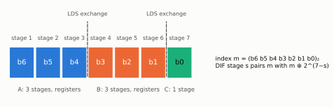

*Figure 10. Register blocking as a partition of index bits (illustrative grouping 3 + 3 + 1). Stages inside a
group are butterflies between a thread's own registers. Only the group boundaries cost an LDS exchange and a
barrier: 2 instead of 7.*

### 5.3 Bank conflicts and the XOR swizzle

LDS is organised as 32 banks of 4 bytes (AMD 2025, CDNA3 ISA). Accesses in one cycle proceed in parallel only if
they fall in *distinct banks*. A 64-bit element $e$ occupies banks $2(e \bmod 16)$ and $2(e \bmod 16)+1$, so its
**conflict class** is $e \bmod 16$. In the exchange phases, threads access points at strides that are multiples of 16 or 32,
so all of them hit the same bank: a 16- or 32-way conflict serialises the access. Permuting the
storage index with

$$
e' = e \oplus \big((e \gg 4)\ \&\ 15\big)
$$

spreads any stride-16 column across 16 distinct banks while remaining a bijection (XOR with a function
of the high bits).

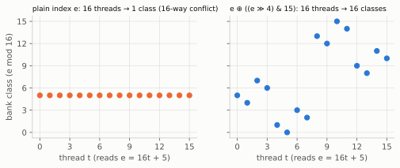

*Figure 5. Sixteen threads read a column at stride 16 (elements $16t + 5$). Without the swizzle every access falls
in class 5 and they serialise 16-way. With $e' = e \oplus ((e \gg 4)\,\&\,15)$ the class becomes $5 \oplus t$, which
takes all 16 values. The map is its own inverse ($e \gg 4$ is unchanged by it), so reads and writes use the same formula.*

Measured on the earlier kernel: +5 % forward (2 211 → 2 325 Gbfly/s), and the performance
spread across the four APUs fell from 12.4 % to 1.8 % (ALGORITHM S6).

### 5.4 Twiddles from two tables

Stage twiddles $\omega^m$ for $m$ up to $n$ would need a table as large as the data, one full extra
plane of memory (~12 % of the budget). Since $m$ splits as $m = q\cdot T + r$,

$$
\omega^m = \underbrace{(\omega^{T})^{q}}_{t_1[q]}\cdot\underbrace{\omega^{r}}_{t_2[r]},
$$

two tables of $\approx\sqrt n$ entries and **one** extra modular multiply give any twiddle. Both
tables fit in cache, and the extra multiply is hidden in the next point.

### 5.5 The paradox: fewer instructions, slower kernel

At stage $m$ the first butterfly of every group uses $\omega^0 = 1$, so ≈ 18 % of butterflies multiply
by one. In the register-blocked kernel some of these are statically known. Specialising them removed
**10 % of the instructions and 16 % of the multiplies, with the same register count, and the kernel
became 3.3 % slower**, on all four APUs individually (ALGORITHM R9).

The explanation matters more than the 3 %. An earlier micro-benchmark had shown the butterfly to be
*issue-bound* (latency/throughput ≈ 1) in registers. The real kernel also waits on global twiddle
loads and LDS exchanges, and the "useless" multiplications were **filling those wait slots**. Removing
them exposed the stalls. **Instruction count is not a proxy for time in a latency-hiding machine.** This is Volkov's (2010)
observation in another form: GPU throughput comes from enough independent work in flight, whether as more
warps (occupancy) or as more independent instructions per thread (ILP), to cover memory latency. The
kernel sits at a local optimum where arithmetic and memory latency are balanced, and perturbing either
side loses. Two other "obvious" wins failed the same way: an LDS-staged twiddle table (0.96×, lost
occupancy) and non-temporal loads (0.66×, broke coalescing).

### 5.6 Why the matrix cores are not used

MI300A's int8 matrix cores deliver 880 TMAC/s per APU. A 62-bit modular product decomposes into
$8\times 8 = 64$ int8 multiply-accumulates, giving 13.8 T products/s, **6.81×** the vector unit's
2.02 T/s. But matrix cores compute *dense* matrix products, and a DFT of radix $r$ as a dense matrix
does $r^2$ multiplies where the butterfly network does $\tfrac r2\log_2 r$:

| radix | butterfly modmuls | dense | ratio |
|---|---|---|---|
| 4 | 4 | 16 | 4.0× |
| 16 | 32 | 256 | **8.0×** |
| 32 | 80 | 1 024 | 12.8× |

The best case, radix 16 (the matrix tile size), does 8.0× the work at a 6.81× rate: **0.85×**, slower,
before any modular reduction or layout conversion (ALGORITHM R10). The two factors nearly cancel,
which is why the idea looks close and is not.

---

## 6. The distributed four-step transform

### 6.1 Intuition

The top products of the tree are too large for one APU. The transform must be spread over four
APUs (or thousands, across nodes), and an FFT's data dependencies are global: the last stage combines
points that are $n/2$ apart. Bailey's four-step algorithm (1990) reshapes the length-$n$ transform
as a matrix of $R$ rows × $C$ columns so that all dependencies are either within a row, or within a
column, plus one elementwise multiply. Rows can be local to one GPU. The *transpose* between
the row phase and the column phase is the only global communication: one **all-to-all** exchange
(each GPU sends a slab to every other), called the corner turn.

### 6.2 The factorisation

Let $n = RC$. Store point $m = i + R\,j$ at row $i$, column $j$ ($0\le i<R$, $0\le j<C$). Write the
output index as $s = v + C\,u$. Then, with $\omega_n$ a primitive $n$-th root and
$\omega_R = \omega_n^{C}$, $\omega_C = \omega_n^{R}$:

$$
\omega_n^{ms} = \omega_n^{(i+Rj)(v+Cu)} = \omega_R^{\,iu}\ \cdot\ \omega_n^{\,iv}\ \cdot\ \omega_C^{\,jv}
\quad(\text{the } \omega_n^{RCju} = 1 \text{ term vanishes}),
$$

so

$$
X[v + Cu] \;=\; \sum_{i=0}^{R-1}\omega_R^{\,iu}\;\underbrace{\omega_n^{\,iv}}_{\text{twiddle}}\;
\underbrace{\sum_{j=0}^{C-1}\omega_C^{\,jv}\,x[i+Rj]}_{\text{length-}C\text{ DFT of row } i}.
$$

Read right to left, these are the four steps: (1) a length-$C$ DFT along every **row**; (2) multiply
entry $(i,v)$ by $\omega_n^{iv}$; (3) transpose; (4) a length-$R$ DFT along every **column**. In
Kronecker notation (Van Loan 1992), as `ntt_dist.h` states it:

$$
F_n = \Pi\,(F_R\otimes I_C)\,D\,(I_R\otimes F_C)\,S ,
$$

with $S$ the input stride permutation, $D$ the diagonal twiddle matrix and $\Pi$ the transpose.

### 6.3 Ownership: why a GPU's data is block-cyclic

With $P$ ranks each owning $R/P$ consecutive **rows**, rank $r$ holds points
$i + Rj$ for $i\in[rR/P, (r{+}1)R/P)$ and **every** $j$. In terms of the integer's limbs, that is $C$
runs of $R/P$ contiguous limbs, one run per column: a **block-cyclic** distribution, not a contiguous
slice. This follows from doing the row pass first, which is what makes step (1) communication-free.

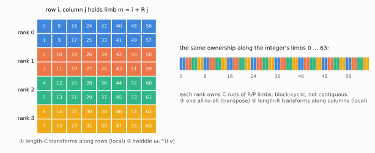

*Figure 6. $R = C = 8$, four ranks. Left: the $R\times C$ layout, with rows owned by ranks. Right: the same ownership read
along the integer, where each rank holds $C$ runs of $R/P = 2$ consecutive limbs. Steps ①–② are local to each
rank, ③ is the only communication, and ④ is local again.*

The alternative, contiguous ownership (rank $r$ holds limbs $[rn/P, (r{+}1)n/P)$), costs a second
all-to-all per transform, and there is no formulation of the inverse with a single all-to-all under it
(modelled and run, RESULTS §51, §59). `ecalc` therefore keeps the numbers **contiguous at the
interfaces** (so additions, shifts and the division see ordinary slices) and converts to block-cyclic
**inside** the product with a *local* transpose (rows×C ↔ C×rows needs no communication). The carries
after the inverse cross rank boundaries at every run end. They are resolved with one neighbour
exchange of $C$ carry flags (chapter 10).

**Per product: three all-to-alls,** one per forward transform of each operand and one for the
inverse. The pointwise product happens in the transposed ("column") layout, so it needs none.

### 6.4 The exchange itself

On MI300A's Infinity Fabric the measured all-to-all rates were counter-intuitive
(ALGORITHM S9):

| method | node GB/s |
|---|---|
| `hipMemcpyPeerAsync` (DMA engine) | 418 |
| kernel *pull* (remote loads), 128-bit | 399 |
| kernel *push* (remote stores), 128-bit | 699 |
| **kernel push, 64-bit** | **909** |
| kernel push, 256-bit | 368 |

The fabric prefers narrow stores, the opposite of local HBM. One push kernel drives all three links at
once: 0.45 → 0.18 s for the 12 exchanges of a $2^{31}$-point product. The exchange is **pipelined**
(`DIST_CHUNKS`, default 4): the rows are cut into chunks, and chunk $k$'s all-to-all runs while chunk
$k{+}1$'s row transform and twiddle compute. (In isolation the push corner turn overlapped butterfly
compute at 74 %; `bench/11`.)

**A volume check.** A $2^{31}$-point plane of 8-byte residues is 17.2 GB per prime. In an all-to-all over $P = 4$
APUs, each rank keeps $1/P$ of its quarter and sends the rest, so a fraction $(P-1)/P$ of the plane crosses the
fabric:

$$
V = 3 \times n_p \times \frac{P-1}{P}\times 8n = 3\times 4\times\tfrac34\times 17.2\ \text{GB} \approx 155\ \text{GB per product}
$$

(three all-to-alls, four primes: the "12 exchanges"). At 909 GB/s that is 0.17 s, against 0.18 s measured.
The exchange runs at the fabric's rate, and the only way to cut its cost is to cut $V$. That is why the design
minimises the **number** of all-to-alls rather than their speed.

---

## 7. Grid splitting

### 7.1 Intuition

The transform planes have a fixed maximum size: the **plane cap**, $2^{31}$ points per prime per
product by default. It is chosen because larger planes cost more memory than they save time. A product
whose result needs more points is cut into pieces. Write $A = \sum_i A_i B^{o_i}$ and
$B' = \sum_l B'_l B^{o_l}$ with pieces that fit, and then

$$
A B' = \sum_{i,l} A_i B'_l\, B^{o_i + o_l},
$$

a grid of $k_a \times k_b$ piece products added at shifted offsets. This is the long-multiplication
algorithm with "digits" of a billion limbs.

### 7.2 The costs, and the two optimisations that make the grid cheap

**Transform reuse.** A naïve grid costs $2k_ak_b$ forward transforms. But $B'_l$ is the same for
every $i$ in column $l$, so its transform can be cached, and likewise $A_i$. With a few cached
"slots" the grid costs about $k_a + k_b$ forward transforms plus $k_ak_b$ pointwise products and
inverses (`rns_dist.c`, `mul_grid`).

**Skipping pieces nobody reads.** Several products in the division only need part of the result:
the **low** $w$ limbs ($X\cdot Q$ for the remainder), or everything **above** a cut ($A_h\mu$, and the
reciprocal's two products, chapter 8). A piece at offsets $(o_a, o_b)$ with $\ell_a\times\ell_b$ limbs
lies entirely below $B^{o_a+o_b+\ell_a+\ell_b}$. If that is at or below the cut, the piece is skipped.
The skipped mass is bounded, which is what makes the answer provably still correct (§8.5).

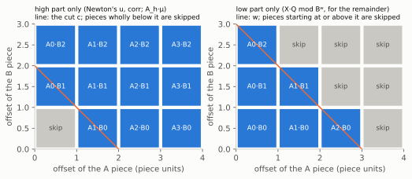

*Figure 7. A $4\times 3$ grid of piece products. Piece $A_iB_l$ contributes to limbs
$[o_i + o_l,\ o_i + o_l + \ell_a + \ell_b)$, so lines of constant $o_a + o_b$ are lines of equal limb position. Left:
when only the part above a cut is read, pieces wholly below it are skipped. Right: for a low product, pieces
starting at or above $w$ are skipped.*

**Choosing the grid.** With transform reuse, the cost of a $k_a\times k_b$ grid is modelled as

$$
T(k_a,k_b) \approx (k_a + k_b)\,T_{\text{fwd}}(L) \;+\; k_a k_b\,\big(T_{\text{pw}}(L) + T_{\text{inv}}(L) + T_{\text{add}}\big),
\qquad \ell_a + \ell_b \le L \le L_{\text{cap}},
$$

minus the skipped pieces. The piece shape is the minimiser of this cost over $(k_a, k_b)$ and the piece
lengths, subject to each piece product fitting the cap. It turned decimal's $2.2\times10^9$-limb
squared products from 8 planes into 6, with no memory change (dm 48.9 → 38.0 s; RESULTS §66).

### 7.3 Grid steps: why the wall time jumps

The piece count is an integer function of the operand size, so the run time is a **staircase**. At
576 nodes (modelled): going from 4.435 to 4.464 × 10¹³ digits raises the pieces on the critical path from
214 to 248, **+12.6 % time for +0.65 % digits**. The production target was placed at 4.25 × 10¹³,
on a flat stretch below the steps (RESULTS §80, §82).

### 7.4 Why not Karatsuba

Karatsuba replaces a 2×2 grid's 4 products by 3, using the sums $A_0 + A_1$ and $B_0 + B_1$. Modelled
on the device grid: −15 to −23 % of the division time, but **+68–89 GB of memory** for the sums and
the third product. In decimal the half-sums ($1.11 + 1.11\times10^9$ limbs) do not even fit a plane.
Rejected on memory: the recurring verdict.

---

## 8. Division by Newton's method, done exactly

The dm phase computes $X = \lfloor A/Q\rfloor$ for $A = 10^d(P+Q)$: a division of a
$2\times$-size number by a full-size one. It is the single largest structure after binary splitting, and
the one with the subtlest correctness argument.

### 8.1 Intuition

Long division is quadratic. Newton's method finds $1/Q$ using only multiplications: from an
approximation $r$, the refinement

$$
r' = r + r(1 - Qr)
$$

roughly **doubles the number of correct digits**. The error $\varepsilon = 1 - Qr$ becomes
$\varepsilon^2$. So one needs only about $\log_2(\text{digits})$ steps, and, more importantly, each step
can be computed at the precision it will deliver: the first steps are tiny, and the total cost is
about that of the last step, a small constant times one full multiplication (Brent & Zimmermann 2010, §4.2;
Bernstein 2008). The quotient is then $X \approx A\cdot(1/Q)$, followed by a small correction.

*Worked example ($Q = 7$, $r_0 = 0.1$):*

| step | $r$ | $\varepsilon = 1 - 7r$ | correct digits of $1/7 = 0.142857\ldots$ |
|---|---|---|---|
| 0 | 0.1 | 0.3 | 0 |
| 1 | 0.13 | 0.09 | 1 |
| 2 | 0.1417 | 0.0081 | 2 |
| 3 | 0.14284777 | 0.00006561 | 4 |
| 4 | 0.14285714… | 4.3 × 10⁻⁹ | 8 |

*Each step squares $\varepsilon$ and doubles the correct digits. The first steps are cheap because they need only a
few digits.*

### 8.2 The fixed-point iteration used

Everything is in integers. With base $B$ ($2^{64}$ or $10^{18}$) and $n_Q$ limbs of $Q$, the
reciprocal $r$ approximates $B^{n_Q + j}/Q$ with $j$ limbs of precision. One step from $j$ to $2j$
(`newton.c`, `newton_db.c`):

1. $Q_t$ = the top $\min(2j+2, n_Q)$ limbs of $Q$ (only that much of $Q$ matters at precision $2j$).
2. $u = \lfloor Q_t r / B^{\text{take}-j}\rfloor \approx B^{2j}$. **(product 1)**
3. $d = B^{2j} - u$, signed, about $j$ limbs: the scaled residual $1 - Qr$.
4. $\mathit{corr} = \lfloor r\,|d| / B^{j}\rfloor$. **(product 2)**
5. $r' = r\,B^{j} \pm \mathit{corr}$.

This is the **correction form**: it multiplies by the small residual $d$ rather than squaring $r$.
The reproduced paper's form computes $r^2$ and $Q_tr^2$. The correction form's two products
($Q_tr$ and $r\,d$) take three device multiplies where the paper's $r^2$ and $Q_tr^2$ take four plus a split, and it is self-checking: if
$\mathit{corr} \ge B^{j+1}$ the input was not accurate enough, and the step repeats at the same
precision; if $r' \le 0$ (overshoot) $r$ is shrunk by 1/16 and retried. The paper's truncated-$r^2$ step
was found **not sound as printed** (RESULTS §39). The correction form matched the paper's time within
4 %.

### 8.3 Anchored doubling

Doubling from the seed gives precisions $j_0, 2j_0, 4j_0, \dots$, which almost never land on the
required $k$. The last step then computes at a full $2j > k$ and throws most of it away. `ecalc` instead
plans the targets **backwards from $k$**: $k, \lceil k/2\rceil, \lceil k/4\rceil, \dots$ down to the
seed, so every step is a (near-)exact doubling and the last one lands on $k$ exactly. Measured: binary
291 → 271 s, the decimal reciprocal **112 → 45 s** (RESULTS §53–54).

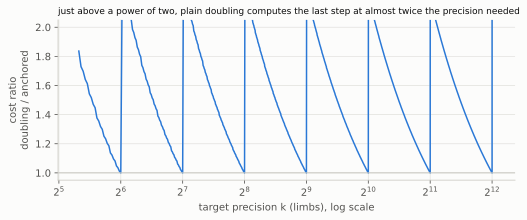

*Figure 8. Modelled cost of the precision schedule, with $M(n) = n\log_2 n$ and seed precision 4. Plain doubling
(4, 8, …, $2^m$, then a final step computed at $2^{m+1}$) against anchored doubling ($\ldots, \lceil k/4\rceil, \lceil k/2\rceil, k$).
The ratio approaches 2 just above each power of two.*

### 8.4 The error recurrence

Let $\rho = B^{\text{take}}/Q_t \in (1, B]$ and let $E = R_j - r$ be the input error in units of $r$'s last
limb, with $R_j$ the exact real target. Let $\theta, \varphi \in [0,1)$ be the fractions discarded by the
floors in steps 2 and 4. Expanding the steps gives, exactly (R114 §1.1):

$$
r' \;=\; R_{2j} \;-\; \frac{E^2}{\rho} \;+\; \frac{r\,\theta}{B^{j}} \;-\; \varphi,
\qquad 0 \le \frac{r\theta}{B^j} < \rho .
$$

The $E^2/\rho$ term is Newton's quadratic convergence. The other two terms are the rounding the integer
version adds. The map $E \mapsto E^2/\rho - \rho\theta + \varphi$ sends $(-\rho, \rho+1]$ into itself, so
the chain's error is **bounded by $\rho + 1$ units** at every step, and the final $\mu$ is within a few
units of $\lfloor B^{n_Q+k}/Q\rfloor$. The unit test measures ≤ 8.

### 8.5 Cutting the products to the band that is read

Step 2 reads only $t_1 \gg v$ (with $v = \text{take} - j$), and step 4 only $t_1 \gg j$. With the grid of
§7, whole pieces below the band can be skipped at a cut $c = v - g$ with $g \ge 1$ guard limbs. The
skipped sum $S$ satisfies $0 \le S < n_{\text{skip}}B^{c}$, so

$$
\Big\lfloor \tfrac{t_1 - S}{B^v}\Big\rfloor = \Big\lfloor \tfrac{t_1}{B^v}\Big\rfloor - \delta,\qquad
\delta \in\{0,1\},
$$

and $\delta = 1$ only when the fractional part of $t_1/B^v$ is below $n_{\text{skip}}/B^{g}$, a
probability of about $10^{-15}$ per product. Substituted into the recurrence, the cut adds an error **of
the same kind and size as the floor already present**: $|r'_{\text{cut}} - r'| \le \rho + 1$. So the
analysis of §8.4 covers it unchanged, and in practice the results are bit-identical. Measured at 10¹¹:
reciprocal 44.6 → 40.8 s (−8.5 %), for free (`NEWTON_RECIP_CUT`, RESULTS §83).

### 8.6 The division and its corrections

With $\mu \approx B^{n_Q+k}/Q$: $X_0 = \lfloor A_h\,\mu / B^{k+1}\rfloor$, where $A_h$ is the top $k$ limbs of
$A$. The dropped low limbs and $\mu$'s error move $X_0$ by at most a few units. The code then applies
down-corrections while $XQ > A$ and up-corrections while $R = A - XQ \ge Q$, and it **aborts beyond 64
corrections**. Hence the key property: **whenever the run completes, $X$ is exact.** The only failure
mode is a loud abort, never a silent wrong digit. $XQ$ is formed only as its low $n_Q+1$ limbs (a
*low product*, since the high part is known to match $A$), which the grid produces by skipping every
piece above $w$.

### 8.7 On device-resident numbers

In the final design the reciprocal and division run on numbers split into quarters, one per APU
(`dbig`), with every product through the four-APU transform of chapter 6 and every addition, shift or
comparison a kernel per quarter. Newton temporaries are **views and pointer swaps**, not copies, and all
blocks come from the regions binary splitting has just released (chapter 11). Reciprocal at 4 × 10¹⁰:
29.7 → 12.0 s (binary), host memory during dm 155 → 80 GB (RESULTS §59, §63).

---

## 9. Base 10¹⁸ throughout

### 9.1 What is being avoided

A binary result must be converted to decimal at the end, and at 10¹⁰⁺ digits that conversion is a
full-scale divide-and-conquer computation: the **long pole** of most record programs. The fastest
method, Bernstein's **scaled remainder tree** (2004), treats $X/10^d$ as a fraction in $[0,1)$ and
repeatedly multiplies by powers of $10$, keeping the integer part as leading digits and the fractional
part for the rest. Written as a recursion on a fraction $y\in[0,1)$ whose first $h = h_1 + h_2$ digits are wanted,

$$
\mathrm{digits}_h(y) \;=\; \mathrm{digits}_{h_1}(y)\ \big\Vert\ \mathrm{digits}_{h_2}\big(\{10^{h_1}y\}\big),
$$

where $\{\cdot\}$ is the fractional part and each branch needs $y$ only to about $h_i$ digits plus guard digits.
That is a tree of $O(\log d)$ levels, each level a full-size multiplication in total, with inexact
fixed-point arithmetic whose carry corner cases (a fractional part of $0.999\ldots$) are notoriously
hard to get right, and a table of powers of 10 that costs another full-size number of memory. The
reproduced paper's dc phase took 82.5 s at 4 × 10¹⁰, the largest phase of all.

### 9.2 The alternative: never be binary

`ecalc` stores every number in limbs of base $B = 10^{18}$ (the largest power of 10 below $2^{64}$,
wasting only $\log_2(2^{64}/10^{18}) \approx 4.2$ bits per limb, ≈ 6.6 %). Then:

- **Output is formatting**: each limb prints as 18 digits. dc 82.5 → **4.2 s**.
- **$10^d$ is a shift**: $B^{\lfloor d/18\rfloor}\cdot 10^{d \bmod 18}$. 10dP 9.3 → **1.7 s**.
- **The convolution and transform are base-agnostic**: they see coefficient lists. Only the **CRT output
  stage** changes: a reconstructed coefficient (< $2^{156}$) is split into base-$10^{18}$ digits by
  Barrett division with $\mu = \lfloor 2^{123}/10^{18}\rfloor$ (`ec_div1e18`: at most 3 corrections).
  Three primes then suffice (chapter 3).

The cost moves elsewhere: the CPU seeds need a Barrett `mul_1` by $10^{18}$ (seeds 5 → 10 s), and
decimal numbers are 6.6 % longer, which pushed the $4.44\times10^9$-limb top products from 4 planes to 6
(+6 s in bs, +8 s in dm). Net, at 4 × 10¹⁰ on one node: **35 % faster and 31 % less peak host memory**
than the same code in binary (phases 108.9 vs 167.1 s; host 160 vs 233 GB; RESULTS §63). Decisively
for the multi-node design, a decimal number needs **no distributed radix conversion**: each rank formats
its own limbs.

---

## 10. Carries as a parallel prefix

### 10.1 Intuition

Adding two long numbers seems inherently sequential: the carry into limb $k$ depends on limb $k-1$,
which depends on $k-2$, and so on. Usually a carry dies within a limb or two. But a run like
$\ldots 999\,999 + 1$ propagates the whole way, and a GPU cannot afford a sequential pass over
billions of limbs. The escape is the observation behind the carry-lookahead adder: a block of limbs can
be summarised by **what it does to an incoming carry**, without knowing the carry yet.

### 10.2 Generate / propagate

For a chunk (4096 limbs in `dbig`) compute the local sum assuming carry-in 0, and record two flags:

- **generate** $g$: the chunk produces a carry-out even with carry-in 0;
- **propagate** $p$: the chunk's local sum is all $(B-1)$ digits, so a carry-in would pass straight through.

Chunk summaries compose associatively:

$$
(g_2, p_2)\circ(g_1, p_1) = \big(g_2 \lor (p_2 \land g_1),\ p_2\land p_1\big),
$$

so the carry into every chunk is an **exclusive prefix scan** of these pairs (the carry-lookahead recurrence of
Kogge & Stone 1973; the scan framework of Ladner & Fischer 1980 and Blelloch 1990): logarithmic depth, or a single cheap pass over the few chunk flags ($n/4096$ of them;
`ecalc` scans them on the host). A final kernel adds each chunk's carry-in, which ripples only through
that chunk's leading $(B-1)$ limbs.

*Worked example (base 10, chunks of 3 digits, adding $x = 214\,999\,607$ and $y = 000\,000\,395$; chunks listed
from the least significant):*

| chunk | local sum (carry-in 0) | $g$ | $p$ | carry in (scan) | final |
|---|---|---|---|---|---|
| 0: 607 + 395 | 002, carry out 1 | 1 | 0 | 0 | 002 |
| 1: 999 + 000 | 999 | 0 | 1 | $g_0 = 1$ | 000, carry out 1 |
| 2: 214 + 000 | 214 | 0 | 0 | $g_1 \lor (p_1 \land g_0) = 1$ | 215 |

*The result is $215\,000\,002$. Chunk 1's carry-in is known from the flags alone, before any digit of chunk 1 is
revisited.*

### 10.3 Why the obvious alternatives fail

A thread per chunk chaining carries serially is **latency-bound** at ~100 GB/s. An atomic ripple is
**pathological** on long carry chains, exactly the case that must be handled. Both were measured
(RESULTS §59). With four APUs, the quarter boundaries and (inside the distributed transform) the
block-cyclic run boundaries of §6.3 are just more chunk boundaries in the same scan: one exchange of
flags per product.

---

## 11. Memory as the binding constraint

### 11.1 The ledger

Let $W$ = the size of the result ≈ 0.415 bytes per decimal digit in binary, 0.444 in base $10^{18}$.
At the peak of binary splitting the node holds the current level's $P$ and $Q$ (≈ $2W$), the next
level's being formed, the transform planes of the products in flight (3 primes × the plane cap × 8 bytes,
per APU), and the pinned staging buffers. `mem_model.py` computes this per phase and per node, **exact
against the measured runs** (RESULTS §76). Peak node memory: 253 GB at 4 × 10¹⁰, 445 GB at 10¹¹, 466.6 GB
at 1.4 × 10¹¹, against 502 GB physical.

### 11.2 Locality: a 40-to-1 bandwidth ratio

MI300A packages CPU and GPU dies around a single HBM pool (AMD 2023, CDNA 3 white paper), but the node's four APUs
still form four NUMA domains. An MI300A GPU reads memory on its **own** NUMA node at ≈ 3.8 TB/s and **any other** node's at ≈ 93 GB/s,
whether the memory is `hipMalloc`'d or ordinary OS pages. **The allocation kind is irrelevant; the node
is everything** (RESULTS §55). Consequences:

- The binary-splitting pools are **four device regions with subtree ownership**: APU $a$ owns a quarter
  of every level's nodes, and each product is transformed by the APU whose region holds its
  operands. The batch tier's scatter went from 0.141 to 0.024 s per level (44.8 → 27.5 s total).
- Anything that makes every APU read a shared pool is capped at ≈ 700 GB/s by the links, whatever the
  pool is made of.

### 11.3 Reuse across phases

When binary splitting finishes, its regions are **donated** to the division phase's block allocator
(`db_donate`). There is no `hipMalloc` inside the loop (it costs 0.057 s/GB whatever the block size),
and the division's temporaries live in memory that the previous phase already paid for.

### 11.4 Fragmentation, and why the 1.4 × 10¹¹ run first failed

Tightening the reservation to the exact modelled need (`DM_TIGHT`) cut the arena from 310 to 260 GB
at 10¹¹. But at 1.4 × 10¹¹ one large block repeatedly found no **contiguous** free range: the free
memory existed, fragmented into holes, and six placement strategies all failed. The fix separates
*address* from *memory*. A pool built on HIP's virtual-memory API (`DB_POOL_VMM`; `hipMemAddressReserve`, `hipMemCreate`, `hipMemMap`, AMD ROCm docs) reserves a large
virtual range and maps physical chunks into it on demand. A request is satisfied by re-mapping free
physical chunks, wherever they are, into one contiguous virtual block. Result: **zero in-phase
allocations and 1.4 × 10¹¹ digits verified in 485 s at 466.6 GB**, beyond the previous 1.30 × 10¹¹
ceiling at that plane cap (RESULTS §83).

### 11.5 The rule, as a table of rejections

| rejected | speed | memory |
|---|---|---|
| Karatsuba over the device grid (§7.4) | −15…23 % dm | +68–89 GB |
| 3·2³⁰-point planes | −3.6 s phases | +60 GB, +4.7–6.3 s mapping: a net loss |
| precomputed transforms of radix-conversion powers | 1.3× | 2.8× the power table |
| two 62-bit primes (§4.5) | — | higher peak and 2.2× slower as built |
| out-of-core to network storage | — | ~5 000× slower than HBM |

---

## 12. Proving the digits correct

### 12.1 Intuition

Rerunning a 10¹¹-digit computation to check it doubles the cost, and a second run on the same
hardware and code may repeat the same mistake. Instead, `ecalc` checks algebraic **identities** that the
true results must satisfy, evaluated modulo small primes, where each check costs one pass over the data.
Reducing mod $q$ is a ring homomorphism: $(xy) \bmod q$ depends only on $x \bmod q$ and $y \bmod q$. So
an identity between huge numbers can be tested on their 62-bit residues.

### 12.2 The T1 identities

For eight primes $q_i$ (the first eight primes above $2^{62}$), with $T = 10^d$ and $R$ the division's remainder:

$$
T\,(P + Q) \;\equiv\; X\,Q + R \pmod{q_i}, \qquad
\text{digits}(X) \;\equiv\; X \pmod{q_i}.
$$

- $P \bmod q$ and $Q \bmod q$ are computed **independently** by running the binary-splitting recurrence
  directly in $\mathbb{Z}/q$, over word-size numbers, on the CPU.
- $X, R$ are reduced by Horner's rule over their limbs, and the digit string by Horner's rule over its
  characters.

The first identity checks every multiplication, the reciprocal and the division. The second checks the
output formatting. If a result is wrong, the discrepancy $\Delta \neq 0$ escapes a check only if
$q_i \mid \Delta$. The precise statement is a counting argument. If $|\Delta| < 2^{S}$, then $\Delta$ has at most
$S/62$ distinct prime factors above $2^{62}$. There are about $2^{62}/(63\ln 2) \approx 10^{17}$ primes in
$[2^{62}, 2^{63})$, so for a modulus drawn at random from them,

$$
\Pr[q \mid \Delta] \;\le\; \frac{S/62}{10^{17}} \approx 5\times10^{-8}\quad (S \approx 3\times10^{11}\ \text{bits}),
$$

and about $(5\times10^{-8})^8 \approx 10^{-58}$ for eight independent draws. With *fixed* moduli the same number is a
heuristic (it assumes the error does not "know" the moduli). §12.3 shows how that assumption fails.

Residues of billion-limb numbers are computed in parallel by splitting Horner's rule over chunks of $L$ limbs:

$$
X \bmod q \;=\; \sum_{c}\big(X_c \bmod q\big)\cdot\big(B^{L} \bmod q\big)^{c} \bmod q ,
$$

one Horner pass per chunk $X_c$, then a short combine. **T2** adds 50-digit windows at fixed positions compared with published
digits, which guards against a wrong $d$, $N$ or off-by-one in the output.

### 12.3 Failure 1: seven of the eight "primes" were composite

`verify.c` had listed $2^{62} + \{135, 179, 183, 247, 315, 319, 349, 397\}$ as "the first primes above
$2^{62}$". **Only the first is prime** (RESULTS §76). Two of the composites have all their prime factors
below $2.5\times10^7$. Since $Q = Q(0,N) = N!$ with $N \sim 10^9$–$10^{10}$, $Q$ contains every prime factor
of such a modulus:

$$
q \text{ composite with all factors} \le N \quad\Longrightarrow\quad Q \equiv 0 \pmod q,
$$

and the first identity degenerates to $T\,P \equiv R$. **It no longer involves $X$ or $Q$ at all**, so it
cannot see an error in them. That is why failures had read "wrong at six moduli, OK at two", a pattern
that was misinterpreted as a checker bug. With the true primes the probability claim holds. (The
checker had still caught every wrong result: every historical failure did have wrong digits.) The
lesson: a residue check's strength depends on the modulus being coprime to the structure of the
quantities being checked, and $n!$ is maximally non-coprime.

### 12.4 Failure 2: a copy that returned before it ran

Under forced memory-pool growth, a node's leaf $P$ and $Q$ occasionally came out wrong, in 5 of 26
runs, and **never when a per-level debugging probe was on**. The signature was precise: $P$ wrong from
limb ≈ $2^{17}$, $Q$ wrong from that limb plus 3 961 286. Those offsets are exactly the trailing-zero counts
of the two operands of one product, which shows that **one stale operand** was feeding one multiply,
rather than two separate errors.

The cause is a platform property of ROCm 7.2.4 on MI300A: **a same-device device-to-device `hipMemcpy`
returns before the copy has run** (a peer copy is host-synchronous; a same-device one is not). The
level loop's copy of an odd node was issued on the destination's null stream and nothing waited for it.
The next level's kernels on the other three APUs read the operand 0.1–0.2 ms later, while the copy was
still landing (0.2–3 ms). Any probe added enough delay to hide it. Fix: the copy helper waits for its
copy. Evidence: a 5-for-5 reproducer (`tests/t_copy_order`), and 56/56 clean forced-growth runs
afterwards (RESULTS §77). The residue checks detected the fault, and the dump tooling (`ECALC_LEAF_DUMP`,
level-by-level residues) located it.

### 12.5 Independent recheck

`ECALC_RECHECK=1` re-verifies a finished run from its files alone: the digit file, a sidecar of
residues, and a checkpoint of the top-level $P, Q$. It reports RECHECK FAILED on a copy with one digit
flipped.

---

## 13. Scaling to 576 nodes

The same program runs as one process per node. Each node computes the leaf tree over its own range of
terms. The top $\log_2(\text{nodes})$ levels run as distributed products over **node groups**, pairing
at every level (a schedule such as 2, 4, …, 64, 576), with the four-step transform of chapter 6
generalised to groups of any size: rows split ⌊R/4g⌋ or ⌈R/4g⌉ per rank, and `alltoallv` for uneven
slabs. $P$ and $Q$ end sharded over all nodes, as do the reciprocal and division; every node formats
and writes its own part of the digits. Transports: TCP and OpenSHMEM (`putmem_nbi` + signal).

Three findings from the calibrated model (`mn_model.py`), each of which runs against intuition:

- **The fabric is not the bottleneck:** 13–15 % of the per-node time is exposed communication.
- **An extra dragonfly-topology layer does not pay** at 576 nodes: it relays cross-group bytes twice.
- **Early Newton doublings belong on small groups:** the first steps of the reciprocal are small,
  and spreading them over 576 nodes only multiplies message counts (1.5 M → 0.55 M messages per APU,
  reciprocal 16.0 → 13.3 s).

Projection, **modelled on measured per-node inputs with the fabric assumed** (100 GB/s per APU, 2 µs
per message): **4.25 × 10¹³ digits in ≈ 3.9 min at 452 GB per node**. One node's share, 7.64 × 10¹⁰
digits, was run for real: 137.9 s, VERIFY OK, within 6.2 % of the model's time and 0.5 % of its memory.

---

## 14. Evaluation and lessons

### 14.1 From the reproduced paper to the final design (4 × 10¹⁰ digits, one node)

| stage | phases (s) | wall (s) | peak host |
|---|---:|---:|---:|
| paper as published | 285.7 (total) | — | 256 GB |
| Phase 4: faithful reproduction | 229 | 291 | 248 GB |
| binary final (same code, `LIMB_BASE=2`) | 167.1 | 191.5 | 233 GB |
| decimal final, Phase 8 | 108.9 | 133.7 | 160 GB |
| Phase 11 | 66.0 | 81.5 | 11.7 GB host (numbers on device) |
| **Phase 13c defaults** | **46.3** | **63.5 ± 1.5** | device-resident |

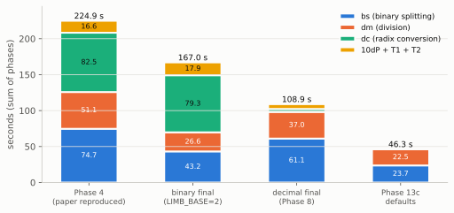

*Figure 9. The sum of phases at 4 × 10¹⁰ digits, split by phase (RESULTS §63, §80). Phase 4's bars sum to
224.9 s; the reported 229 s includes time outside the listed phases. Base $10^{18}$ removes dc; the device-resident
design then halves bs and dm.*

### 14.2 Where the factor of 4.5 came from

| chapter | technique | measured effect |
|---|---|---|
| 1 | level-synchronous batching | avoids 815 s–7 h of launch overhead |
| 4 | FP64 Barrett over Shoup/Montgomery | 2–3 % per pass; 2.2× vs the 62-bit engine |
| 5 | register-blocked 7-stage body | +19 % / +15 % transforms |
| 3 | GPU CRT with fused adds | 0.5 vs 0.8–1.5 s per 2³¹; batch tier 3.6× |
| 2 | 3·2ᵏ lengths | −7 s |
| 6 | push all-to-all over three links | 0.45 → 0.18 s per product |
| 7 | cost-minimising grid | dm 48.9 → 38.0 s |
| 8 | anchored doubling; band cut | reciprocal 112 → 45 s; −8.5 % at 10¹¹ |
| 9 | base 10¹⁸ | −35 % phases, −31 % host memory |
| 11 | NUMA subtree ownership | batch tier 44.8 → 27.5 s |
| 11 | VMM pool + tight reservation | ceiling 1.30 → ≥ 1.40 × 10¹¹ digits |

### 14.3 Lessons that generalise

1. **Find the binding resource and optimise in its currency.** Here that resource is memory, so a speedup
   that costs memory is a loss. That one rule accounts for most rejected designs.
2. **Instruction count is not time** on a latency-hiding processor (§5.5).
3. **Micro-benchmarks do not transfer** to real passes: Shoup won in registers and lost in the kernel
   (§4.5), and non-temporal loads were 1.10× in the node report's benchmark and 0.66× in this kernel.
4. **Locality beats allocation kind** (§11.2).
5. **Exactness must be argued, not assumed**, and the argument checked. The FP64 operand rule (§4.4), the
   Newton band cut (§8.5) and the verification moduli (§12.3) were all places where plausible code was
   wrong, or right only under stated conditions.

---

## References

Grouped by topic. Where a free, authoritative copy exists, a link is given.

**Series evaluation and multiprecision arithmetic**
- B. Haible, T. Papanikolaou, "Fast multiprecision evaluation of series of rational numbers," *ANTS-III*,
  LNCS 1423 (1998) 338–350. [PDF](https://www.ginac.de/CLN/binsplit.pdf)
- R. P. Brent, P. Zimmermann, *Modern Computer Arithmetic*, Cambridge Univ. Press, 2010: §4.2 (Newton's
  method), §4.9 (binary splitting), ch. 1–2 (multiplication, division, CRT).
- D. J. Bernstein, "Fast multiplication and its applications," in *Algorithmic Number Theory*, MSRI Publ. 44,
  Cambridge Univ. Press (2008) 325–384. [cr.yp.to/papers.html#multapps](https://cr.yp.to/papers.html#multapps)
- D. J. Bernstein, "Scaled remainder trees," 2004. [PDF](https://cr.yp.to/arith/scaledmod-20040820.pdf)
- J. Arndt, *Matters Computational: Ideas, Algorithms, Source Code*, Springer, 2011 (NTTs, binary splitting,
  radix conversion). [Free PDF](https://www.jjj.de/fxt/fxtbook.pdf)
- R. Crandall, C. Pomerance, *Prime Numbers: A Computational Perspective*, 2nd ed., Springer, 2005, ch. 9.
- D. E. Knuth, *The Art of Computer Programming*, Vol. 2, 3rd ed., Addison-Wesley, 1997, §4.3 (Algorithm D,
  §4.3.2 modular arithmetic and Garner's method) and §4.6.
- G. Hanrot, M. Quercia, P. Zimmermann, "The middle product algorithm I," *AAECC* 14 (2004) 415–438.
- A. J. Yee, y-cruncher: technical documentation. [numberworld.org/y-cruncher](http://www.numberworld.org/y-cruncher/)
- "High-Performance Computation of e to 40 Billion Decimal Digits on a Single MI300A Node" (the reproduced paper, 4 pp.).

**Instructional sources**
- R. P. Brent, P. Zimmermann, *Modern Computer Arithmetic*, free electronic version 0.5.9.
  [PDF](https://maths-people.anu.edu.au/~brent/pd/mca-cup-0.5.9.pdf), especially ch. 1 (integer division by
  Newton's method) and ch. 2 (the FFT over finite rings, the CRT).
- cp-algorithms, "Fast Fourier transform" (long-integer multiplication, NTT, iterative butterflies).
  [cp-algorithms.com/algebra/fft.html](https://cp-algorithms.com/algebra/fft.html)
- A. J. Yee, "Binary Splitting" (y-cruncher internals: the two-variable "hyperdescent" recursion used for e).
  [numberworld.org](https://www.numberworld.org/y-cruncher/internals/binary-splitting.html)

**Fast Fourier and number-theoretic transforms**
- J. W. Cooley, J. W. Tukey, "An algorithm for the machine calculation of complex Fourier series,"
  *Math. Comp.* 19 (1965) 297–301.
- W. M. Gentleman, G. Sande, "Fast Fourier transforms — for fun and profit," *AFIPS Fall Joint Computer
  Conference* 29 (1966) 563–578.
- J. M. Pollard, "The fast Fourier transform in a finite field," *Math. Comp.* 25 (1971) 365–374.
- A. Schönhage, V. Strassen, "Schnelle Multiplikation großer Zahlen," *Computing* 7 (1971) 281–292.
- D. Harvey, J. van der Hoeven, "Integer multiplication in time O(n log n)," *Annals of Math.* 193 (2021)
  563–617. [doi:10.4007/annals.2021.193.2.4](https://doi.org/10.4007/annals.2021.193.2.4)
- D. H. Bailey, "FFTs in external or hierarchical memory," *J. Supercomputing* 4 (1990) 23–35.
  [PDF](https://www.davidhbailey.com/dhbpapers/fftq.pdf)
- C. Van Loan, *Computational Frameworks for the Fast Fourier Transform*, SIAM, 1992 (Kronecker-product
  formulation of the four-step and six-step algorithms).
- J. van der Hoeven, "The truncated Fourier transform and applications," *Proc. ISSAC 2004*, 290–296.
  [doi:10.1145/1005285.1005327](https://dl.acm.org/doi/10.1145/1005285.1005327)
- A. Karatsuba, Yu. Ofman, "Multiplication of multidigit numbers on automata," *Soviet Physics Doklady* 7
  (1963) 595–596.

**Modular and floating-point arithmetic**
- P. Barrett, "Implementing the Rivest Shamir and Adleman public key encryption algorithm on a standard
  digital signal processor," *CRYPTO '86*, LNCS 263, 311–323.
- P. L. Montgomery, "Modular multiplication without trial division," *Math. Comp.* 44 (1985) 519–521.
- V. Shoup, NTL: A Library for doing Number Theory (the precomputed-quotient "MulMod" with `mulmod_precon`).
  [libntl.org](https://libntl.org/)
- D. Harvey, "Faster arithmetic for number-theoretic transforms," *J. Symbolic Comput.* 60 (2014) 113–119.
  [arXiv:1205.2926](https://arxiv.org/abs/1205.2926)
- H. L. Garner, "The residue number system," *IRE Trans. Electronic Computers* EC-8 (1959) 140–147.
- T. J. Dekker, "A floating-point technique for extending the available precision," *Numer. Math.* 18
  (1971) 224–242.
- T. Ogita, S. M. Rump, S. Oishi, "Accurate sum and dot product," *SIAM J. Sci. Comput.* 26 (2005) 1955–1988.
- J.-M. Muller et al., *Handbook of Floating-Point Arithmetic*, 2nd ed., Birkhäuser, 2018 (error-free
  transformations, 2MultFMA). [Book page](https://perso.ens-lyon.fr/jean-michel.muller/Handbook.html)

**Parallel algorithms and GPU architecture**
- P. M. Kogge, H. S. Stone, "A parallel algorithm for the efficient solution of a general class of recurrence
  equations," *IEEE Trans. Computers* C-22 (1973) 786–793.
- R. E. Ladner, M. J. Fischer, "Parallel prefix computation," *J. ACM* 27 (1980) 831–838.
- G. E. Blelloch, "Prefix sums and their applications," Tech. Rep. CMU-CS-90-190, 1990.
- V. Volkov, "Better performance at lower occupancy," GPU Technology Conference, 2010.
  [PDF](https://www.nvidia.com/content/gtc-2010/pdfs/2238_gtc2010.pdf)
- AMD, *AMD CDNA 3 Architecture* white paper, 2023.
  [PDF](https://www.amd.com/content/dam/amd/en/documents/instinct-tech-docs/white-papers/amd-cdna-3-white-paper.pdf)
- AMD, *AMD Instinct MI300 "CDNA 3" Instruction Set Architecture Reference Guide*, 2025 (LDS organisation, MFMA).
  [PDF](https://www.amd.com/content/dam/amd/en/documents/instinct-tech-docs/instruction-set-architectures/amd-instinct-mi300-cdna3-instruction-set-architecture.pdf)
- AMD ROCm documentation, "HIP virtual memory management."
  [rocm.docs.amd.com](https://rocm.docs.amd.com/projects/HIP/en/latest/how-to/hip_runtime_api/memory_management/virtual_memory.html)

In-repository sources: `ALGORITHM.md` (segments S1–S16, reviews R1–R14, corrections in Part 6),
`RESULTS.md` (§§38–83; section numbers are cited above), `results/R114.md` (the Newton band-cut proof),
`ecalc/modarith.h`, `newton.c`, `ntt_dist.h`, `rns_dist.c`, `dbig.h`, `verify.h`. Chapter A's numbers are printed by `docs/walk/toy_run.py`. Figures 1–10 are generated by
`docs/fig/make_figs.py` from the formulas stated in their captions or from the cited RESULTS sections.

## Appendix: parameters

| quantity | value |
|---|---|
| primes | $p_i = c_i 2^{44} + 1$, $c = 240, 216, 207, 147$; generators 19, 5, 5, 10 |
| max transform length | $3\cdot 2^{33}$ |
| primes per product | 3 (base $10^{18}$), 4 (base $2^{64}$) |
| plane cap | $2^{31}$ points per prime (`ECALC_PLANE_CAP`) |
| seed span | 256 terms |
| Barrett constant for $10^{18}$ | $\lfloor 2^{123}/10^{18}\rfloor$ |
| T1 moduli | $2^{62} + \{135, 169, 177, 187, 189, 193, 253, 277\}$ |
| division corrections | abort beyond 64 |
| all-to-all pipeline | 4 chunks (`DIST_CHUNKS`) |
